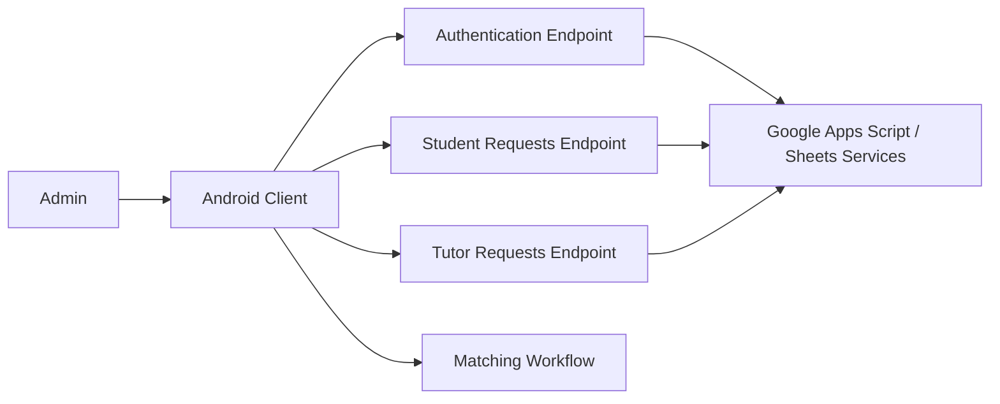

# Students for Students | Tutor Matching Automation

An Android admin tool built for **Students for Students**, a student-run tutoring initiative, to make tutor-student matching faster and easier to manage.

The project replaced a manual Google Sheets workflow with a lightweight application for reviewing tutoring requests, finding students and tutors, moving selected records through the matching workflow, and keeping the process connected to the organization's existing spreadsheet-based operations.

> **Project status:** Portfolio archive of the completed application. The repository includes the Android APK, development documentation, and a **sanitized export of the core MIT App Inventor client logic**. Live Google Apps Script endpoints, credentials, student records, and the original operational backend are intentionally not published.

## Problem

Tutor matching was previously handled manually in spreadsheets. As the number of students and tutors increased, this created repetitive administrative work and made it harder to respond quickly to tutoring requests.

The goal was to design a tool that could:

- reduce the time required to process tutoring requests
- keep the workflow connected to existing Google Sheets data
- make unmatched students and tutors easier to identify
- let administrators search and review records without manually navigating spreadsheets
- preserve a simple interface that non-technical administrators could use

## Solution

The application provides an admin-facing Android workflow for authentication, loading student and tutor requests, searching records, reviewing details, and progressing selected students into the matching flow.



The recovered `.aia` project is the **client layer**. Operational data services were handled through external Google Apps Script / Google Sheets integration, so the client source alone does not represent the full system.

## Key Features

- **Admin authentication** with form validation and login-state feedback
- **Student request retrieval** from an external data service
- **Tutor request retrieval** from an external data service
- **Search by request ID** for student and tutor records
- **Structured request views** showing name, grade, and subject
- **Student selection handoff** into a dedicated matching screen
- **JSON parsing and validation** for web-service responses
- **Error handling** for missing records and invalid responses
- **Client-informed interface design** refined during development

The original project documentation also describes the broader operational matching and communication workflow. Parts of that workflow depended on external services that are not included in this public archive.

## Documented Outcomes

The project documentation records the following results:

- manual matching time reduced to **under 1.5 minutes**
- matching success rate of **90% or higher** under the evaluated test conditions
- workflow designed to support responses to tutoring requests within **48 hours**

These are documented project-evaluation results, not current production service-level guarantees.

## Product Thinking

The project started with an existing user workflow rather than a purely technical exercise:

1. understand how administrators were matching students and tutors manually
2. translate the workflow into functional requirements
3. design a simple admin interface around the highest-frequency tasks
4. connect the interface to the organization's existing data source
5. reduce repetitive searching and record handling
6. test the solution against the original success criteria
7. iterate using client feedback and usability observations

It is an example of taking a real operational problem from discovery through design, implementation, and evaluation.

## Technology

| Area | Technology |
|---|---|
| Client platform | Android |
| Client development | MIT App Inventor / Blockly |
| Data integration | Google Apps Script + Google Sheets |
| Data format | JSON |
| Product documentation | IB Computer Science IA development process |

## Repository Structure

```text
student-matching-automation-system/
├── Source/
│   ├── README.md
│   └── src/appinventor/.../Student4Student/
│       ├── Screen1.bky
│       ├── StudentRequests.bky
│       ├── TutorRequests.bky
│       └── MatchScreen.bky
├── Development/
│   ├── Appendix A.pdf
│   ├── Appendix B.pdf
│   ├── Criterion_A_Planning.pdf
│   ├── Criterion_B_Design.pdf
│   ├── Criterion_B_RecordofTasks.pdf
│   ├── Criterion_C_Development.pdf
│   ├── Criterion_D.mp4
│   ├── Criterion_E_Evaluation.pdf
│   └── README.md
├── Product/
│   ├── SOS Admin App.apk
│   └── README.md
├── .gitignore
└── README.md
```

### Start here

- **Want to understand the product?** Read this README.
- **Want to inspect implementation logic?** Open [`Source/`](Source/).
- **Want the complete design/development evidence?** Open [`Development/`](Development/).
- **Want the archived Android build?** Open [`Product/`](Product/).

## Source Code and Privacy

The original MIT App Inventor project contained hard-coded Google Apps Script URLs for authentication and operational data retrieval. Because this is a public repository, those endpoints were removed before publishing the source export and replaced with non-routable `example.invalid` placeholders.

The published source demonstrates the client-side implementation without exposing the original service URLs or private operational data. See [`Source/README.md`](Source/README.md) for the architecture and security notes.

## Installation

> The APK is an archived student-project build, not a maintained production release.

```bash
git clone https://github.com/rmuthukumar23/student-matching-automation-system.git
cd student-matching-automation-system
```

Then transfer `Product/SOS Admin App.apk` to an Android device and install it if you trust the build.

The archived APK depends on the original external services, so it may not operate as a standalone application today.

## Typical Admin Flow

1. Sign in as an administrator.
2. Load current student or tutor requests.
3. Search for a specific request ID or review the request list.
4. Inspect the student's or tutor's grade and subject details.
5. Select the relevant student and continue into the matching workflow.
6. Use the connected operational process to complete and record the match.

## Engineering Lessons and Future Improvements

A production rebuild would prioritize:

- separating configuration and service URLs from UI blocks
- replacing password-in-query authentication with a secure session or token flow
- separating data-access, matching, and UI concerns
- publishing or rebuilding the backend matching/data service in a conventional source-controlled stack
- adding automated tests for parsing, matching criteria, and edge cases
- replacing positional spreadsheet fields with a typed data model
- adding audit history for administrator actions
- moving from a spreadsheet-dependent backend to a structured datastore if usage grows

---

**Built for Students for Students as an IB Computer Science project focused on solving a real administrative workflow problem.**
