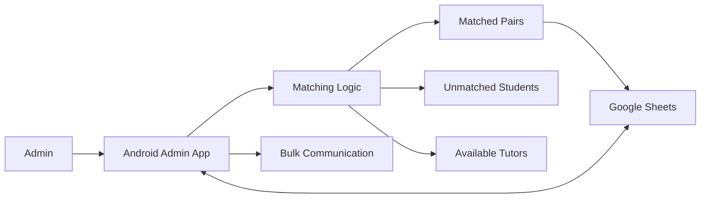

# Students for Students | Tutor Matching Automation

An Android admin tool built for **Students for Students**, a student-run tutoring initiative, to make tutor-student matching faster and easier to manage.

The project replaced a manual Google Sheets matching workflow with a lightweight application that imports tutoring requests and tutor availability, applies matching criteria, updates records, and supports follow-up communication from one interface.

> **Project status:** This repository is a portfolio archive of the finished application and its development documentation. The installable APK and project reports are included. The original MIT App Inventor source project is not currently published in this repository.

## Problem

Tutor matching was previously handled manually in spreadsheets. As the number of students and tutors increased, this created repetitive administrative work and made it harder to respond quickly to tutoring requests.

The goal was to design a tool that could:

- reduce the time required to process matches
- keep tutor and student records synchronized with Google Sheets
- make unmatched requests easy to identify
- support administrators without requiring technical knowledge
- preserve a simple workflow that could fit the organization's existing process

## Solution

The application provides administrators with a single workflow for importing data, reviewing availability, running the matching process, updating records, and communicating with participants.



## Key Features

- **Automated tutor matching** based on compatibility criteria
- **Google Sheets integration** for importing and updating operational data
- **Admin authentication** before accessing the workflow
- **Match tracking** using unique matchup IDs
- **Unmatched request visibility** for students and tutors who still require action
- **Bulk email support** for follow-up communication
- **Input validation and error handling** for common data issues
- **Client-informed interface design** refined through feedback during development

## Documented Outcomes

The project documentation records the following results:

- manual matching time reduced to **under 1.5 minutes**
- matching success rate of **90% or higher** under the evaluated test conditions
- workflow designed to support responses to tutoring requests within **48 hours**

These figures reflect the project's own evaluation and are included here as documented project outcomes rather than production service-level guarantees.

## Product Thinking

This project was not only an implementation exercise. It started with an operational problem and an existing user workflow.

The development process focused on:

1. understanding how administrators were performing tutor matching manually
2. translating the workflow into clear functional requirements
3. designing a simple interface around the administrator's tasks
4. automating the repetitive parts of matching and record updates
5. testing the solution against the original success criteria
6. iterating based on client feedback and observed usability issues

The result is a compact example of taking a real user problem from discovery through design, implementation, and evaluation.

## Technology

| Area | Technology |
|---|---|
| Platform | Android |
| Application development | MIT App Inventor |
| Data layer | Google Sheets via web/API integration |
| Product documentation | IB Computer Science IA development process |

## Repository Structure

```text
student-matching-automation-system/
├── Development/
│   ├── Appendix A.pdf
│   ├── Appendix B.pdf
│   ├── Criterion_A_Planning.pdf
│   ├── Criterion_B_Design.pdf
│   ├── Criterion_B_RecordofTasks.pdf
│   ├── Criterion_C_Development.pdf
│   ├── Criterion_D.mp4
│   ├── Criterion_E_Evaluation.pdf
│   └── README.md
├── Product/
│   ├── SOS Admin App.apk
│   └── README.md
├── .gitignore
└── README.md
```

The `Development/` directory contains the planning, design, implementation, demonstration, and evaluation material. The `Product/` directory contains the Android APK.

## Installation

> Only install APK files that you trust. This repository contains an archived student project build rather than a maintained production release.

1. Clone the repository:

```bash
git clone https://github.com/rmuthukumar23/student-matching-automation-system.git
cd student-matching-automation-system
```

2. Transfer `Product/SOS Admin App.apk` to an Android device.
3. Allow installation from the relevant source if Android prompts for permission.
4. Install the APK.

The application depends on external data and authentication services used by the original project, so the archived build may not function as a standalone production application today.

## Typical Admin Flow

1. Sign in as an administrator.
2. Import current student and tutor data.
3. Review unmatched students and available tutors.
4. Run the matching workflow.
5. Review generated pairings and unresolved requests.
6. Write matchup IDs and status updates back to Google Sheets.
7. Send follow-up communication where required.

## Development Documentation

For a deeper view of the engineering and product process, see the files in [`Development/`](Development/). They cover planning, requirements, interface and system design, development, testing, evaluation, and the final demonstration.

## Privacy and Repository Hygiene

This is a public repository. Any future development should use test or anonymized data and must not commit student records, credentials, API keys, or other private operational information.

## Future Improvements

If this project were developed further, the highest-value improvements would be:

- publish the original source project or rebuild the application in a conventional source-controlled framework
- separate matching logic from the user interface so it can be tested independently
- add automated tests for matching edge cases
- move credentials and configuration into secure environment-specific storage
- replace spreadsheet-dependent workflows with a structured backend if usage grows
- add audit history and clearer administrator review before finalizing matches

---

**Built for Students for Students as an IB Computer Science project focused on solving a real administrative workflow problem.**
