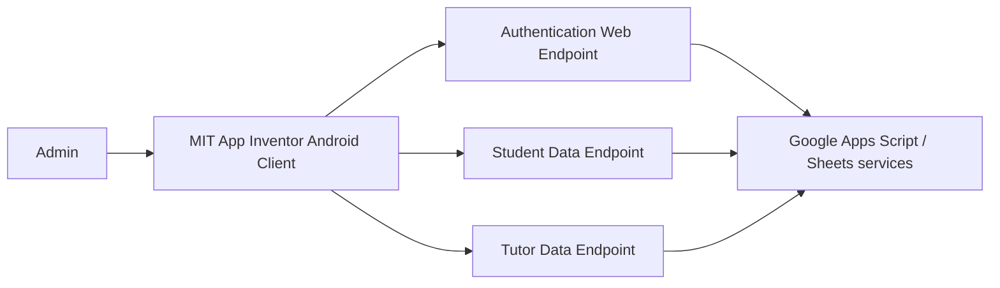

# App Inventor Source

This directory contains a **sanitized export of the core MIT App Inventor client logic** for the Students for Students admin application.

The source was recovered from the original `Student4Student.aia` project. Before publishing it to this public repository, embedded Google Apps Script URLs were removed and replaced with non-routable `example.invalid` placeholders.

## Published logic

MIT App Inventor stores visual Blockly logic in `.bky` XML files. The most relevant client-side logic is published here so reviewers can inspect how the application actually worked:

| File | Responsibility |
|---|---|
| `Screen1.bky` | Admin sign-in, input validation, authentication request, success/failure handling |
| `StudentRequests.bky` | Student-request retrieval, JSON parsing, list rendering, ID search, record selection, and handoff into the matching flow |
| `TutorRequests.bky` | Tutor-request retrieval, JSON parsing, list rendering, and tutor ID search |
| `MatchScreen.bky` | Receives the selected student ID and retrieves/displays the student's details for the next matching step |

The original `.aia` also contains App Inventor screen-definition files and UI image assets. Those binary/project-package artifacts are not required to understand the core client logic shown here. The archived APK remains available in [`Product/`](../Product/).

## Architecture



The recovered `.aia` is the **client layer**, not the complete backend. The original operational Google Apps Script code was not included in the recovered project archive.

## What the source shows

The recovered blocks provide direct evidence of several implementation choices:

- form validation before attempting login
- asynchronous web requests through App Inventor `Web` components
- JSON response decoding into list structures
- list iteration and positional field extraction
- student/tutor lookup by request ID
- conditional handling for missing or invalid records
- navigation between screens with the selected student ID passed as a start value
- explicit UI states such as `Searching...`, invalid-login feedback, and unexpected-response handling

## Public-repository sanitization

The original client contained hard-coded Apps Script URLs for:

- administrator authentication
- student-request retrieval
- tutor-request retrieval

Those URLs have deliberately **not** been published. In the sanitized source they are replaced with:

```text
https://example.invalid/auth
https://example.invalid/student-data
https://example.invalid/tutor-data
```

No production credentials, student records, or private operational data should be committed to this repository.

## Security lessons

The archived implementation reflects the constraints of the original school project. A production rebuild should:

1. move service URLs and configuration out of UI blocks
2. avoid sending passwords in URL query parameters
3. use authenticated HTTPS requests with short-lived tokens or sessions
4. keep student data behind authorization checks
5. separate API/data logic from UI logic so it can be tested independently
6. replace positional spreadsheet fields with a typed data model
7. add structured logging and audit history for administrator actions

## Running the archived client

The original application was created with MIT App Inventor. The published source is intended primarily for **code review and portfolio transparency**. Live service endpoints are intentionally absent, so these files are not a drop-in connection to the original operational system.

For the full project context, see the root [`README.md`](../README.md) and the planning, design, development, and evaluation evidence in [`Development/`](../Development/).
