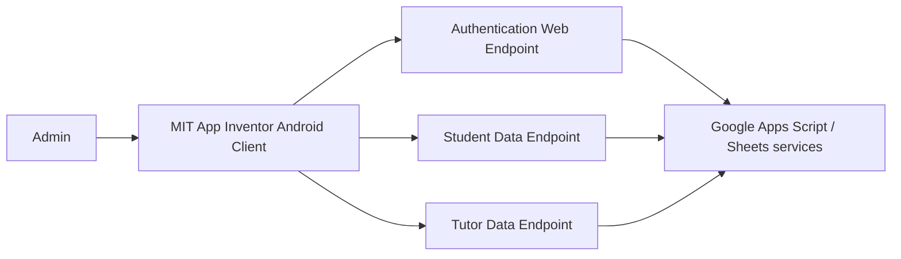

# App Inventor Source

This directory contains a **sanitized export of the original MIT App Inventor client source** for the Students for Students admin application.

The source was recovered from the original `Student4Student.aia` project. Before publishing it to this public repository, the embedded Google Apps Script URLs were removed and replaced with non-routable `example.invalid` placeholders.

## What is included

The App Inventor project is made up of `.bky` files containing Blockly logic and `.scm` files containing screen/component definitions.

| Screen | Responsibility |
|---|---|
| `Screen1` | Admin sign-in, input validation, authentication request, login-state feedback |
| `Home_Page` | Navigation between student, tutor, and matched-record sections |
| `StudentRequests` | Loads student requests, renders the request list, supports ID search, and passes a selected student into the matching flow |
| `TutorRequests` | Loads tutor requests, renders the tutor list, and supports tutor lookup |
| `MatchScreen` | Receives the selected student and retrieves/display student details for the matching workflow |
| `MatchedStudentSection` | Reserved screen for matched-student records in this archived client |
| `MatchedTutorSection` | Reserved screen for matched-tutor records in this archived client |
| `Backup_Screen` | Earlier/backup implementation used during development |

## Architecture



The `.aia` project is therefore the **client layer**, not the complete backend. The original operational Google Apps Script code is not part of the recovered archive.

## Public-repository sanitization

The original client contained hard-coded Apps Script URLs for:

- administrator authentication
- student-request retrieval
- tutor-request retrieval

Those URLs have deliberately **not** been published. In the sanitized source they are replaced with:

```text
https://example.invalid/auth
https://example.invalid/student-data
https://example.invalid/tutor-data
```

No production credentials, student records, or private operational data should be committed to this repository.

## Security lessons

The archived implementation reflects the constraints of the original school project. A production rebuild should improve several areas:

1. move service URLs and configuration out of UI blocks
2. avoid sending passwords in URL query parameters
3. use authenticated HTTPS requests with short-lived tokens or sessions
4. keep student data behind authorization checks
5. separate API/data logic from UI logic so it can be tested independently
6. add structured logging and audit history for administrator actions

## Rebuilding the project

The original project was created with MIT App Inventor. The published source export is intended primarily for **code review and portfolio transparency**. Live service endpoints are intentionally absent, so the archived client will not connect to the original operational data services without reconfiguration.

For the full project context, see the root [`README.md`](../README.md) and the planning, design, development, and evaluation evidence in [`Development/`](../Development/).
